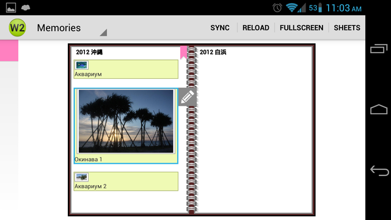
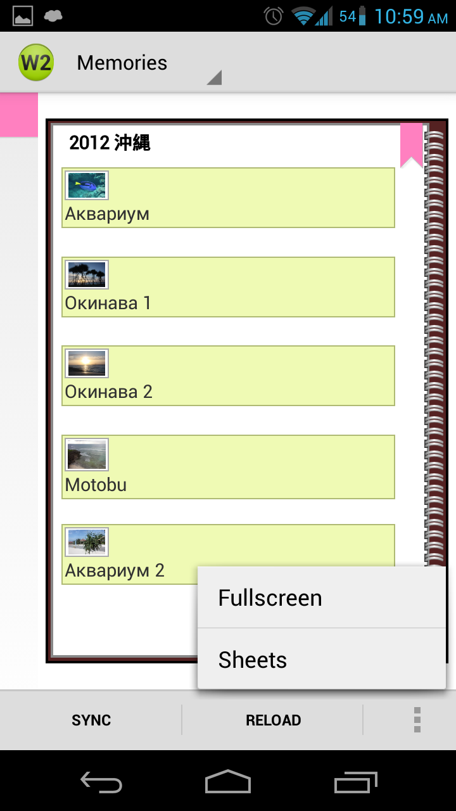
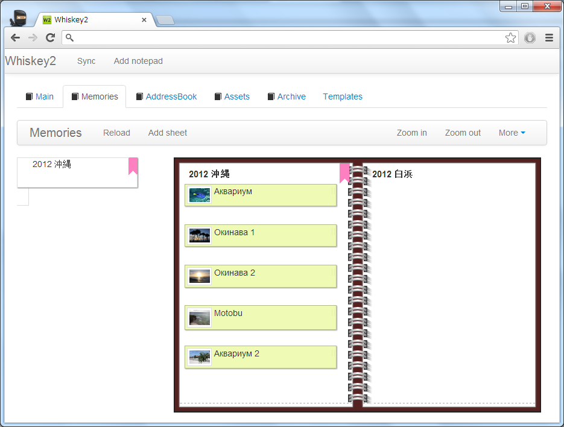
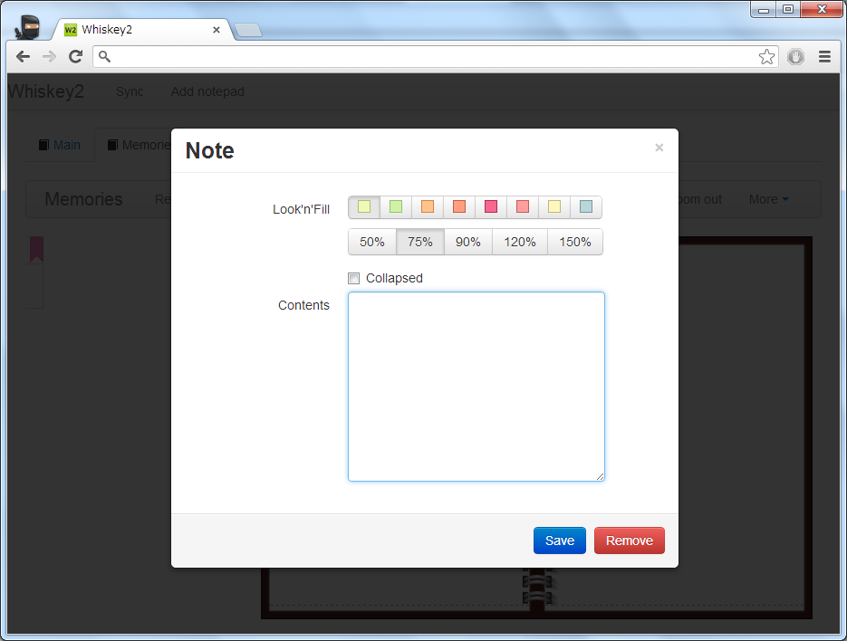

## Whiskey2 - Notetaking application for Web and Android powered by Lima1

### Main features ###
* Latest POC for Lima1
* Built with Twitter Bootstrap, jquery, CoffeeScript, Canto (Canvas), ActionBarSherlock (Android)

### Application features
* Drag'n'Drop support for Notes, Sheets, Bookmarks, Notepads
* Links between Notes on same Sheet
* Inline images, other attachments
* Sheet templates and sheet generators (custom drawing of Sheet background)

### Web version
* Chrome web application
* HTML5 Drag'n'Drop of files on Notes

### Android version
* Android 3.0+ Native Drag'n'Drop
* Zoom via floating toolbar
* Google+ like side menu

### Screenshots

